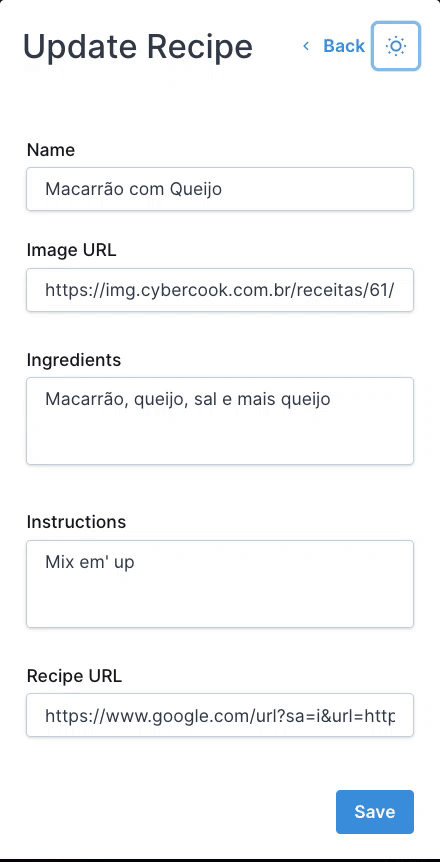

<p align="left">
   
</p>

# Recipes App with Hasura

> A lightweight app made with NextJS and Hasura to create and explore recipes

[](https://github.com/LauraBeatris)
[](#)
[](https://github.com/LauraBeatris/recipes-next-hasura/stargazers)
[](https://github.com/LauraBeatris/recipes-next-hasura/network/members)
[](https://github.com/LauraBeatris/recipes-next-hasura/graphs/contributors)
[](https://dashboard.cypress.io/projects/2ku8bu/runs)

<br />
<p align="center">
  
  &nbsp;&nbsp;&nbsp;
  
</p>

---

# :pushpin: Table of Contents

* [Features](#rocket-features)
* [Installation](#construction_worker-installation)
* [Getting Started](#runner-getting-started)
* [FAQ](#postbox-faq)
* [Found a bug? Missing a specific feature?](#bug-issues)
* [Contributing](#tada-contributing)
* [License](#closed_book-license)

# :rocket: Features

* 🍕&nbsp; Explore recipes
* 🥐&nbsp; Create and update recipes
* 🎨&nbsp; Dark and light mode
* 🌍&nbsp; Multi-Language support - [Portuguese](http://recipes-next-hasura.vercel.app/pt) and [English](http://recipes-next-hasura.vercel.app)

# :construction_worker: Installation

**You need to install [Node.js](https://nodejs.org/en/download/) and [Yarn](https://yarnpkg.com/) first, then in order to clone the project via HTTPS, run this command:**

```git clone https://github.com/LauraBeatris/recipes-next-hasura.git```

SSH URLs provide access to a Git repository via SSH, a secure protocol. If you have a SSH key registered in your Github account, clone the project using this command:

```git clone git@github.com:LauraBeatris/recipes-next-hasura.git```

**Install dependencies**

```yarn install```

# :runner: Getting Started

Run the following command in order to start the application in a development environment:

```yarn dev```


# :postbox: Faq

**Question:** What are the tecnologies used in this project?

**Answer:** The tecnologies used in this project are [NextJS](https://nextjs.org/), [Hasura](https://hasura.io/) to retrieve recipes data via a GraphQL API and [Chakra UI](https://chakra-ui.com/) to implement modular and accessible styled components.


# :bug: Issues

Feel free to **file a new issue** with a respective title and description on the the [Recipes Next Hasura](https://github.com/LauraBeatris/recipes-next-hasura/issues) repository. If you already found a solution to your problem, **I would love to review your pull request**! Have a look at our [contribution guidelines](https://github.com/LauraBeatris/recipes-next-hasura/blob/master/CONTRIBUTING.md) to find out about the coding standards.

# :tada: Contributing

Check out the [contributing](https://github.com/LauraBeatris/recipes-next-hasura/blob/master/CONTRIBUTING.md) page to see the best places to file issues, start discussions and begin contributing.

# :closed_book: License

Released in 2020.
This project is under the [MIT license](https://github.com/LauraBeatris/recipes-next-hasura/master/LICENSE).

Made with love by [Laura Beatris](https://github.com/LauraBeatris) 💜🚀
